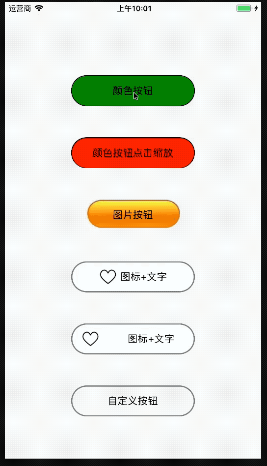

# react-native-sf-button


# 实现Button功能，可设置背景图片、颜色、或者图片+标题模式


# 安装
> npm install react-native-sf-button



# Props 公共属性
|  parameter  |  type  |  required  |   description  |  default  |
|:-----|:-----|:-----|:-----|:-----|
|type|number|yes|按钮类型|null|
|isAnimated|bool|no|是否有点击缩放动画|no|
|title|string|no|标题|null|
|titleColor|string|no|标题颜色|black|
|titleFontSize|number|no|标题字体大小|16|
|titleAlign|string|no|标题对其方式|'center'|
|titleFontWeight|string|no|标题字体宽度|'normal'|
|titleFontFamily|string|no|标题字体|null|
|titelMargin|array('左','上','右','下')|no|标题边距|null|
|containerStyle|object|no|按钮容器样式|null|
|onPress|func </br>(tag)=>{}|no|按钮点击事件|null|
|onPressIn|func </br>(tag)=>{}|no|按钮按下事件|null|
|onPressOut|func </br>(tag)=>{}|no|按钮抬起事件|null|


# Props || type=0 颜色模式
|  parameter  |  type  |  required  |   description  |  default  |
|:-----|:-----|:-----|:-----|:-----|
|defaultColor|string|no|默认背景颜色|white|
|selectColor|string|no|选中背景颜色|null|


# Props || type=1 图片模式
|  parameter  |  type  |  required  |   description  |  default  |
|:-----|:-----|:-----|:-----|:-----|
|defaultImage|number|yes|默认背景图片|null|
|selectImage|number|no|选中背景图片|null|


# Props || type=2 图标+标题模式
|  parameter  |  type  |  required  |   description  |  default  |
|:-----|:-----|:-----|:-----|:-----|
|defaultIcon|number|yes|默认图标|null|
|selectIcon|number|no|选中图标|null|
|iconRatio|number（0-1）|no|图标占按钮|null|
|iconWidth|number|no|图标宽度（单一设置，高度自适应）|null|
|iconHeight|number|no|图标高度（单一设置，宽度自适应|null|
|iconMargin|array('左','上','右','下')|no|图标边距|null|


# 例子
```
import SFButton from 'react-native-sf-button'
export default class App extends Component {
    render() {
        return (
            <View style={styles.container}>
                <SFButton
                    onPress={()=> {
                        alert('1')
                    }}
                    type={0}
                    defaultColor={'red'}
                    selectColor={'green'}
                    title={'颜色按钮'}
                    titleColor={'black'}
                    titleFontSize={16}
                    containerStyle={{
                        marginTop: 50,
                        width: 200,
                        height: 50,
                        borderWidth: 1,
                        borderColor: 'black',
                        borderRadius: 25,
                    }}
                />
                <SFButton
                    type={0}
                    defaultColor={'red'}
                    selectColor={'green'}
                    title={'颜色按钮点击缩放'}
                    isAnimated={true}
                    titleColor={'black'}
                    titleFontSize={16}
                    containerStyle={{
                        marginTop: 50,
                        width: 200,
                        height: 50,
                        borderWidth: 1,
                        borderColor: 'black',
                        borderRadius: 25,
                    }}
                />
                <SFButton
                    type={1}
                    defaultImage={require('./image/btn1.png')}
                    selectImage={require('./image/btn2.png')}
                    title={'图片按钮'}
                    titleColor={'black'}
                    titleFontSize={16}
                    containerStyle={{
                        marginTop: 50,
                        width: 200,
                        height: 50,
                    }}
                />

                <SFButton
                    type={2}
                    defaultIcon={require('./image/p1.png')}
                    selectIcon={require('./image/p2.png')}
                    iconWidth={30}
                    titelMargin={[5, 0, 0, 0]}
                    title={'图标+文字'}
                    titleColor={'black'}
                    titleFontSize={16}
                    containerStyle={{
                        marginTop: 50,
                        width: 200,
                        height: 50,
                        borderWidth: 2,
                        borderColor: 'gray',
                        borderRadius: 25,
                    }}
                />
                <SFButton
                    type={2}
                    defaultIcon={require('./image/p1.png')}
                    selectIcon={require('./image/p2.png')}
                    iconWidth={30}
                    iconRatio={0.3}
                    title={'图标+文字'}
                    titleColor={'black'}
                    titleFontSize={16}
                    containerStyle={{
                        marginTop: 50,
                        width: 200,
                        height: 50,
                        borderWidth: 2,
                        borderColor: 'gray',
                        borderRadius: 25,
                    }}
                />
                <SFButton
                    type={3}
                    containerStyle={{
                        marginTop: 50,
                        width: 200,
                        height: 50,
                        borderWidth: 2,
                        borderColor: 'gray',
                        borderRadius: 25,
                        alignItems: 'center',
                        justifyContent: 'center'
                    }}
                >
                    <Text style={{
                        color: 'black',
                        fontSize: 16
                    }}>自定义按钮</Text>
                </SFButton>
            </View>
        );
    }
}

```
